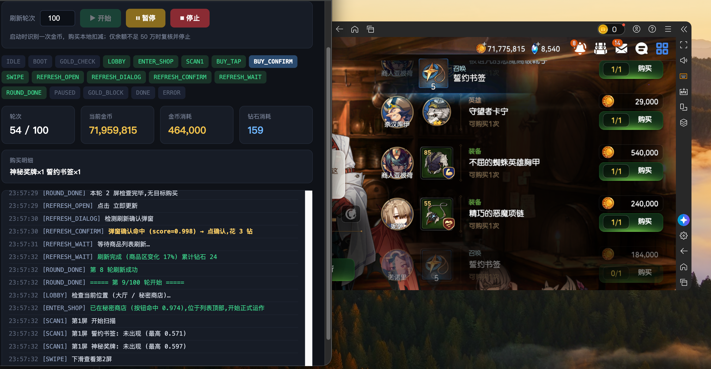

# epic7-shop-bot

第七史诗秘密商店自动刷商店的小脚本，自带一个网页前端，跑起来能实时看着它自己在干嘛。



> 网页监控+游戏本体。


## 它干嘛的

环境 mac mini m4 + 蓝叠模拟器 （淘宝的脚本大多都要求root，mac上能装的蓝叠没办法root，只能走adb，所以自己改了一个）

挂机刷秘密商店：自动扫商店列表，看到「誓约书签」和「神秘奖牌」就买下来，买完点「立即更新」花钻石刷新，然后一轮一轮往下跑。

整个流程写成了一个状态机，所以每时每刻它在干什么都看得见，卡住了也知道卡在哪一步。

## 怎么跑

机器上得先有这几样：（找个agent帮你一键装吧）

- Python 3，装三个库：`pip install opencv-python numpy pytesseract`
- [tesseract](https://github.com/tesseract-ocr/tesseract)（用来认金币数字的）
- adb

游戏那边用模拟器或者手机开着，adb 连上（默认连 `127.0.0.1:5555`），分辨率用1280*720，然后：

```bash
python3 run_machine.py
```

起来之后浏览器打开 **http://127.0.0.1:8787/** ，填一下要刷多少轮，点「开始」就完事了。

## 网页上能看啥

- 开始 / 暂停 / 停止三个按钮，随时能插一脚
- 现在跑到第几轮（比如 54 / 100）
- 当前金币还剩多少
- 这一趟花掉多少金币、多少钻石
- 买到啥了，购买明细列出来
- 上面一排小标签是当前状态，底下是实时日志，每步识别分数都写出来了，方便排查

## 几个坑

- **设备地址**：默认 `127.0.0.1:5555`，对不上的话改 `run_machine.py` 顶上的 `DEVICE`
- **金币保护**：金币低于 50 万会直接停下来（`GOLD_MIN`），免得把家底刷光
- **识别靠模板图**：都放在 `Feature_screenshot/` 里，游戏更新了或者换了分辨率、模拟器缩放变了，可能就认不出来，重新截图标丢进去替换就行
- **匹配阈值**：`THRESH = 0.85`，老认错可以把日志里的分数拿出来对着调

## 其他文件

| 文件 | 干啥的 |
| --- | --- |
| `run_machine.py` | 主力，状态机 + 网页服务 |
| `monitor.html` | 网页前端，跟上面那个同端口 |
| `auto_shop_gui.py` | 最早那版图形界面的，`run_machine.py` 借用了它的点击/滑动/截图函数 |
| `run_full.py` | 命令行版，全自动跑 5 轮 |
| `run_safe.py` | 保险版，只买不刷新，刷新你自己手动点 |
| `test_recognize.py` | 只识别不点击，调模板的时候用 |
| `Feature_screenshot/` | 识别用的模板图 |

## 免责

自己刷过一段时间目前没发现bug，
deepseek-v4.1-flash 帮忙写的，环境不同可能出现的bug概不负责。风险自负。
